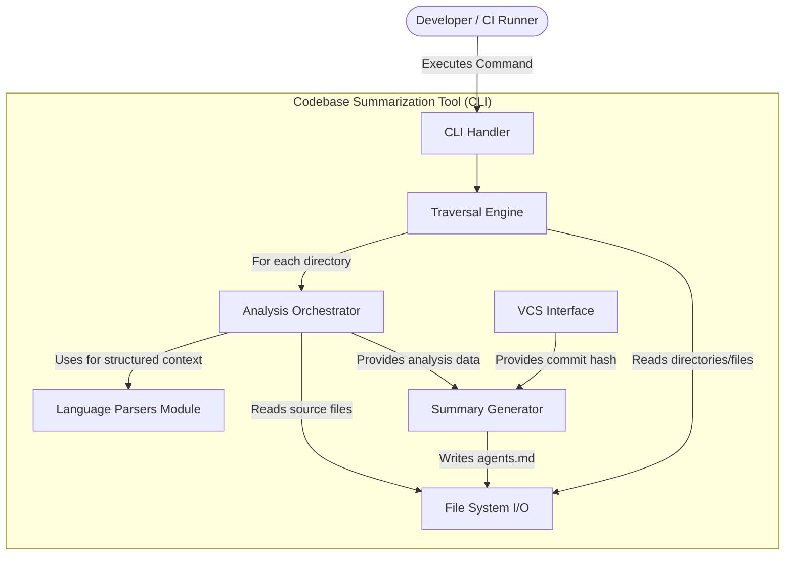
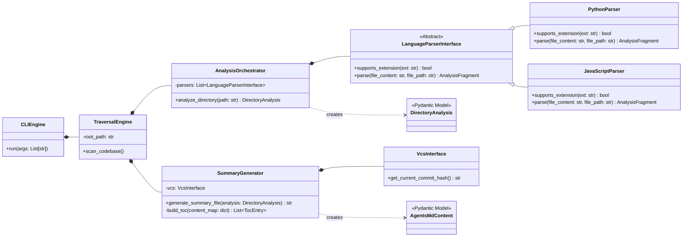

#  Technical Specification
## [TRD-1] System Overview
This document specifies the technical architecture for the Codebase Summarization Tool. The system is a command-line interface (CLI) tool designed to be executed within development environments, version control hooks, and continuous integration/continuous delivery (CI/CD) pipelines.

Its primary function is to perform a depth-first traversal of a specified codebase directory, analyzing the files within each sub-directory to generate a summary file named 

agents.md

. This file acts as a "semantic layer," providing a concise, token-efficient overview of the directory's contents, intended for consumption by AI Coding Agents. By providing this high-level context, the tool enables AI agents to understand and navigate large codebases more effectively, overcoming the context window limitations of Large Language Models (LLMs).

The system will operate as a standalone binary or package, with no external database dependencies. Its state is managed entirely through the 

agents.md

 files it generates within the target codebase.

## [TRD-2] Architectural Drivers
### [TRD-3] Goals
[TRD-4] Extensibility: The internal architecture must be modular to facilitate the addition of new language and framework parsers in future iterations, even though a formal plugin system is out of scope for the MVP. 

[TRD-5] Accuracy: The generated agents.md files must be a precise representation of the codebase at the specific commit they were generated for. Stale summaries are counterproductive. 

[TRD-6] Performance: The tool must execute efficiently to avoid becoming a bottleneck in CI/CD pipelines or local development workflows. It should handle large codebases without excessive resource consumption. 

[TRD-7] Reliability: The tool must run deterministically and handle errors gracefully (e.g., parsing errors in malformed source files) without crashing the entire process. 

[TRD-8] Ease of Integration: The tool must be simple to install and configure within popular version control systems (Git) and CI/CD platforms (GitHub Actions). 

### [TRD-9] Constraints
[TRD-10] MVP Simplicity: The MVP will not implement a plugin-based architecture to minimize initial complexity and de-risk delivery. Language support will be built into the core application. 

[TRD-11] Stateless Operation: The tool must be stateless and not rely on any external databases or services for its core functionality. All required information is either derived from the codebase or passed via command-line arguments. 

[TRD-12] Platform Independence: The tool should be buildable as a cross-platform executable (Linux, macOS, Windows) to support diverse development environments. Python is chosen for its rich ecosystem of parsing libraries (e.g., AST) and cross-platform compatibility. 

## [TRD-13] High-Level Architecture
A monolithic CLI application architecture is chosen for the MVP. This approach simplifies development, deployment, and dependency management while still allowing for a high degree of internal modularity. The core application orchestrates a series of components to perform the scan and generation process.

The main modules are:

[TRD-14] CLI Handler: The entry point of the application, responsible for parsing command-line arguments and flags (e.g., generate, watch, --path). It uses a library like Typer or Click. 

[TRD-15] Traversal Engine: Implements the depth-first traversal logic for the target codebase directory. It identifies directories to process and invokes the Analysis Orchestrator for each one. 

[TRD-16]
For a given directory, it identifies the relevant source files and orchestrates their analysis. This process is driven by a Large Language Model (LLM) which generates a structured summary for the directory by:

 - Directly ingesting the raw content of each file.
 - Leveraging language-specific parsers and language servers to obtain deeper contextual information (e.g., Abstract Syntax Trees, symbol definitions).


The orchestrator manages this LLM-driven analysis and provides the resulting data to the Summary Generator.

[TRD-17] Language Parsers (Internal Modules): A collection of built-in parsers for the supported languages (e.g., Python, JavaScript). Each parser is responsible for extracting specific metadata like APIs, file types, etc. This module is designed with a common interface to support future language additions easily. 

[TRD-18] Aggregates the comprehensive analysis data from the Analysis Orchestrator for a single directory and formats it into the structured agents.md content, including the Table of Contents. 

[TRD-19]
VCS Interface: An optional component to interact with the version control system (e.g., Git) to retrieve metadata like the current commit hash.

In contexts where a commit hash is not yet available (e.g., during a pre-commit hook), this interface must handle the absence of a hash gracefully, for instance by providing a placeholder value.

[TRD-20] File System I/O: A utility module responsible for reading source files and writing the final agents.md files to disk. 

[TRD-97] Metrics and Logging: A cross-cutting module responsible for collecting and logging LLM usage metrics. This includes input/output token counts, processing time, and estimated costs associated with LLM API calls. In accordance with CI/CD requirements, this logging output must support structured JSON formatting. This data is crucial for monitoring operational costs and system performance. 

### [TRD-21] Components Diagram
[TRD-22]


## [TRD-23] Data Architecture and Models
The system does not use a traditional database. The "data" consists of the intermediate data structures used to represent the analysis of a directory and the final serialized 

agents.md

 files written to the filesystem.

To ensure data integrity and clarity throughout the application, all data structures will be implemented using Pydantic models. These models serve as the single source of truth for the shape of the data as it moves between components.

### [TRD-24] Data Models (Pydantic)
These Python Pydantic models define the core data structures for the application logic.

[TRD-25]
```python
from pydantic import BaseModel, Field
from typing import List, Dict
from datetime import datetime

class ApiInfo(BaseModel):
    """
    Represents a single API (function, class, endpoint) found in the code.
    """
    name: str = Field(description="The name of the API, e.g., 'getUserById'.")
    semantic_description: str = Field(description="A concise summary of the API's function, potentially generated by an LLM or extracted from docstrings.")
    source_file: str = Field(description="The file where the API is defined.")
    start_line: int = Field(description="The line number where the API definition starts.")
    end_line: int = Field(description="The line number where the API definition ends.")

class DirectoryAnalysis(BaseModel):
    """
    Represents the complete analysis results for a single directory.
    """
    directory_path: str
    file_types: Dict[str, int] = Field(description="A dictionary mapping file extensions to their count, e.g., {'.py': 5, '.md': 1}.")
    required_skillsets: List[str] = Field(description="A list of dynamically identified skillsets or technology tags, e.g., ['React', 'Django', 'API-Design'].")
    apis: List[ApiInfo] = Field(description="A list of all APIs found within the directory.")

class TocEntry(BaseModel):
    """
    Represents a single entry in the Table of Contents of the agents.md file.
    """
    section_name: str
    start_line: int
    end_line: int

class AgentsMdContent(BaseModel):
    """
    Represents the structured content of a single agents.md file before serialization.
    """
    toc_lines: int = Field(description="The number of lines the Table of Contents will occupy.")
    table_of_contents: List[TocEntry]
    metadata: Dict[str, str] = Field(description="Version metadata, e.g., {'last_generated_utc': '...', 'commit_hash': '...'}. The 'commit_hash' may be a placeholder if not available during generation (e.g., in a pre-commit hook).")
    file_types_summary: str
    required_skillsets_summary: str
    apis_summary: str
```

### [TRD-26] Generated File Structure (agents.md)
The 

agents.md

 file is a plain Markdown file with a specific structure designed for easy parsing by LLMs.

[TRD-27]
```markdown
TABLE-OF-CONTENTS: lines 4-9

[TOC]
- Metadata: 11-13
- File Types: 15-18
- Required Skillsets: 20-23
- APIs: 25-30
[/TOC]

## Metadata
- last_generated_utc: 2023-10-27T10:00:00Z
- commit_hash: a1b2c3d4e5f6a7b8c9d0e1f2a3b4c5d6e7f8a9b0

## File Types
- .py: 10
- .md: 2
- .yml: 1

## Required Skillsets
- Python
- FastAPI
- SQL

## APIs
### `user_service.py`
- **getUserById** (lines 25-45): Fetches a user record from the database by their primary ID.
- **deleteUser** (lines 58-70): Removes a user record from the database.
### `auth_service.py`
- **authenticate** (lines 40-62): Validates user credentials and returns a session token.
```

Note: When generated in a pre-commit context where a commit hash is not yet available, the commit_hash value will be set to a placeholder, such as UNCOMMITTED.

## [TRD-28] Component Blueprint & Class Diagram
The system's logic will be encapsulated within classes that represent the components from the high-level architecture. An abstract base class will define the contract for language parsers to ensure consistency.

### [TRD-29] Class Diagram
[TRD-30]


## [TRD-31] CLI User Experience
The tool's primary interface is the command line. The design must be intuitive for developers and straightforward for automation in scripts.

### [TRD-32] Commands
[TRD-33] summarizer generate: The primary command to perform a one-time scan and generation of agents.md files. 

[TRD-34] Arguments: 

[TRD-35] path: The root path of the codebase to scan. Defaults to the current directory. 

[TRD-36] Options: 

[TRD-37] --force: Force regeneration of all agents.md files, even if they appear up-to-date. 

[TRD-38] --verbose: Enable detailed logging output. 

[TRD-96] summarizer verify: A command intended for CI/CD pipelines to verify that committed agents.md files are in sync with the source code. It regenerates summaries and compares them against the committed files, intelligently ignoring metadata fields (like commit_hash) that are expected to differ. It exits with a non-zero status code if the core content is out of sync. 

[TRD-39] summarizer hook install: A helper command to install the summarizer into a Git pre-commit hook. 

[TRD-40] Options: 

[TRD-41] --type: The type of hook to install (e.g., pre-commit). 

### [TRD-42] Configuration (.summarizerrc)
To avoid repetitive command-line arguments, the tool will support a configuration file (e.g., 

.summarizerrc

) in the root of the repository.

[TRD-43]
```yaml
# .summarizerrc Example
# Defines which directories/files to explicitly ignore during traversal.
exclude:
  - "node_modules/"
  - ".venv/"
  - "*.log"
  - "dist/"
```

## [TRD-44] Mathematical Specifications and Formulas
Precise definitions are required for performance targets and data calculations to ensure verifiable and consistent behavior.

### [TRD-48] Table of Contents Calculation
[TRD-49] The start_line and end_line for each TocEntry must be calculated accurately during the generation of the agents.md file content. 

[TRD-50] Let $L_{header}$ be the number of lines in the static header (including TABLE-OF-CONTENTS-LINES and TABLE-OF-CONTENTS-RANGE lines, [TOC], [/TOC], and blank lines). 

[TRD-51] Let $L_{TOC}$ be the number of lines occupied by the TOC entries themselves. This is equivalent to toc_lines. 

[TRD-52] Let $C_{i}$ be the content of section $i$ and $|C_{i}|$ be the number of lines in that content. 

[TRD-53] The start line for the first section, $S_1.start\_line$, is:$S_1.start\_line = L_{header} + L_{TOC} + 1$ 

[TRD-54] The end line for the first section, $S_1.end\_line$, is:$S_1.end\_line = S_1.start\_line + |C_1| - 1$ 

[TRD-55] For any subsequent section $S_n$ where $n &gt; 1$:$S_n.start\_line = S_{n-1}.end\_line + 2$ (assuming one blank line between sections)$S_n.end\_line = S_n.start\_line + |C_n| - 1$ 

## [TRD-56] DEVOPS Requirements
### [TRD-57] Deployment and Installation
[TRD-58] The tool will be packaged as a Python package and distributed via PyPI. 

[TRD-59] Installation will be performed using pip: pip install codebase-summarizer. 

[TRD-60] A standalone executable can be created for environments without a Python interpreter using tools like PyInstaller. 

### [TRD-61] CI/CD Integration
[TRD-62] The tool is designed to be run in CI/CD pipelines. It must exit with a non-zero status code upon failure to properly fail the pipeline step. 

[TRD-63] All logging output should be directed to stdout and stderr and support structured JSON formatting via a command-line flag for easier machine parsing. 

[TRD-95] To ensure agents.md files are committed with their corresponding code changes, the CI pipeline will include a verification step using the summarizer verify command. This command is designed for CI environments; it regenerates the summaries and compares them to the versions in the commit, ignoring expected metadata changes like the commit_hash. If the command finds that the core summary content is out of sync with the source code, it will exit with an error, failing the pipeline. This enforces that developers commit synchronized summary files. 

#### [TRD-64] Example: GitHub Actions Verification Workflow
[TRD-65]
```yaml
name: Verify Codebase Summaries

on:
  pull_request:
    branches: [ main ]

jobs:
  verify-summaries:
    runs-on: ubuntu-latest
    steps:
    - name: Checkout code
      uses: actions/checkout@v3

    - name: Set up Python
      uses: actions/setup-python@v4
      with:
        python-version: '3.10'

    - name: Install Summarizer Tool
      run: pip install codebase-summarizer

    - name: Verify agents.md files are up-to-date
      run: summarizer verify .
```

### [TRD-66] Version Control Integration
[TRD-67] For local development, the tool will be integrated using pre-commit hooks to ensure agents.md files are updated before a developer commits their code. 

[TRD-68] This will be managed via the .pre-commit-config.yaml file. 

#### [TRD-69] Example:
[TRD-70]
```yaml
repos:
-   repo: local
    hooks:
    -   id: generate-summaries
        name: Generate agents.md summaries
        entry: summarizer generate .
        language: system
        files: \.(py|js|go|ts)$
        stages: [commit]
```

## [TRD-71] Implementation, Validation and Verification Strategy
### [TRD-72] Risk-First Implementation
The implementation will prioritize tackling the highest-risk components first to validate core assumptions early.

[TRD-73] Language Parser for a Complex Language: Implement the JavaScript/TypeScript parser first. This is high-risk due to complex syntax, various module systems (ESM, CJS), and framework-specific patterns (React JSX). Success here will validate the core parsing and analysis approach. 

[TRD-75] CI/CD Integration Prototype: Create a minimal, working prototype integration with GitHub Actions to verify the workflow of checking out code, running the tool, and detecting changes. 

### [TRD-76] Validation and Verification
[TRD-77] Unit Testing: Each component, especially the language parsers, will have extensive unit tests covering various code constructs, edge cases, and malformed files. 

[TRD-78] Integration Testing: The interaction between the TraversalEngine, AnalysisOrchestrator, and SummaryGenerator will be tested to ensure directory analysis data flows correctly and results in a valid agents.md file. 

[TRD-79] End-to-End (E2E) Testing: A suite of sample repositories representing different languages, frameworks, and project structures will be used as test fixtures. E2E tests will run the CLI tool against these repositories and assert that the generated agents.md files match a known-good snapshot. These tests will be executed as part of the CI pipeline for the tool itself. 

### [TRD-80] Resolved TODOs
[TRD-81] TODO: Clarify TOC size format. 

[TRD-82] Decision: The format will be TABLE-OF-CONTENTS-LINES: &lt;integer&gt;. This is a clear and robust format for an LLM to parse. It directly informs the agent how many lines to read to consume the entire Table of Contents. 

[TRD-83] TODO: Define how "skillsets" are determined. 

[TRD-84] Decision: Skillsets will be determined via a dynamic tag system that analyzes file contents to derive relevant technologies and patterns (e.g., "React", "Django", "API-Design"). This replaces the previous approach of a static, user-configurable mapping in .summarizerrc. 

[TRD-85] TODO: Clarify the source for API "semantic description". 

[TRD-86] Decision: The semantic description will be generated by a Large Language Model (LLM). The LLM will create a concise, one-sentence summary of the API's function based on its name and code. Direct extraction from existing docstrings or structured comments will be used as a fallback mechanism. 

[TRD-87] TODO: Specify the exact fields for version metadata. 

[TRD-88] Decision: The metadata will include last_generated_utc (ISO 8601 timestamp) and commit_hash (the full Git commit SHA) when available. In contexts where the hash is not yet generated (e.g., during a pre-commit hook), a placeholder value like UNCOMMITTED will be used. This provides the best possible traceability for each context. 

[TRD-89] TODO: Define the specific version control events that should trigger updates. 

[TRD-90] Decision: For automated CI environments, the recommended trigger is a check within a pull/merge request workflow. For local development, the trigger will be a pre-commit hook. This strategy ensures summaries are validated before code is merged. 

[TRD-93] TODO: Define Key Performance Indicators (KPIs). 

[TRD-94] Decision: The primary success metric will be the Token Efficiency Ratio, calculated as $1 - (\frac{\text{tokens in agents.md}}{\text{tokens in source code}})$. This directly measures the core value proposition of the tool. A secondary metric will be the Adoption Rate, measured by the number of repositories a tool is integrated into. 
